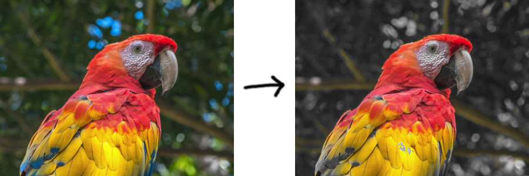

## Concepts

- What are colors? https://en.wikipedia.org/wiki/Color
- Pixels
  https://en.wikipedia.org/wiki/Pixel#/media/File:Pixel_geometry_01_Pengo.jpg
- Image coordinate system
  https://dsp.stackexchange.com/questions/35925/why-do-we-use-the-top-left-corner-as-the-origin-in-image-processing
- RGB color model https://rgbcolorpicker.com/
- How many colors are there?
- Grayscale and luminance https://en.wikipedia.org/wiki/Grayscale
- Color distance https://en.wikipedia.org/wiki/Color_difference#sRGB
- Pillow library: https://pillow.readthedocs.io/en/stable/reference/Image.html

## Demo: Color Channel Manipulation

This demo preserves the colors for pixels that are "red-ish" (more red than blue
or green), and sets the other pixels to grayscale. In the demo image below, we
see that the reds and yellows in the bird are preserved, while the blues and
greens of the background are removed.

```py
from PIL import Image

im = Image.open("bird.png")
output = Image.new(im.mode, im.size)

for y in range(im.height):
  for x in range(im.width):
    (r, g, b) = im.getpixel((x, y))

    if (r < g or r < b):
      l = round((r + g + b) / 3)
      r = l
      g = l
      b = l

    output.putpixel((x, y), (r, g, b))

output.save("output.png")
```



## PIL API

- Dimensions

  ```py
  im.height # image height in pixels
  im.width # image width in pixels
  ```

- Get pixel value:

  ```py
  (r, g, b) = im.getpixel((x, y)) # get rgb values at position x, y
  ```

- Set pixel value:

  ```py
  im.putpixel((x, y), (r, g, b)) # set rgb values at position x, y
  ```

- Use the [`colorsys`](https://docs.python.org/3/library/colorsys.html) module
  to convert between RGB and HSL.

```py
import colorsys # put this at the top of your code along with the PIL import

(h, s, l) = colorsys.rgb_to_hls(r, g, b) # get HSL from RGB
(r, g, b) = colorsys.hls_to_rgb(h, l, s) # get RGB from HSL
```

## Problems

You can use the code in [template.py](template.py) as a starting point for these
problems.

**Invert:** Write a program to invert the colors for each pixel in an image.

**Grayscale:** Write a program to convert an image to grayscale.

**Black and White:** Write a program to convert an image to black-and-white.

**Color Channels:** Write a program to convert any green-ish pixels (pixels that
are more green than they are red or blue) to grayscale.

**Transformation:** Write a program to rotate an image `n` degrees about its
center.

## Concepts (Advanced)

- HSL color model https://hslpicker.com/ and
  https://en.wikipedia.org/wiki/HSL_and_HSV
- Color quantization https://en.wikipedia.org/wiki/Color_quantization
- Dithering
  https://tannerhelland.com/2012/12/28/dithering-eleven-algorithms-source-code.html
- Kernels and convolution https://setosa.io/ev/image-kernels/

## Problems (Advanced)

_You should use the `colorsys` Python module to convert between RGB and HSL for
the saturation and hue problems (see notes above)._

**Saturation:** Write a program that increases an image's saturation to the
maximum amount.

**Hue:** Write a program that shift an image's hue by a certain number of
degrees in HSL.

**Quanitzation:** Choose a color palette of 8 colors. Write a program that
converts an image to use this color palette by finding the closest color in the
palette to each color in the input image.

**K-Means:** Write a program that generates a color palette for an image
automatically using k-means clustering.
https://en.wikipedia.org/wiki/K-means_clustering

_You should work in grayscale for the following problems_.

```py
im = Image.open("bird.png").convert("L") # load input image in grayscale

l = im.getpixel((x, y)) # (grayscale image) get lightness value at position x, y

im.putpixel((x, y), l) # (grayscale image) set lightness value at position x, y
```

**Sharpen Kernel:** Write a program that sharpens an image with the sharpen
kernel. https://en.wikipedia.org/wiki/Kernel_(image_processing)

**Edges Kernel:** Write a program that finds the edges in an image using the
Sobel filter. https://en.wikipedia.org/wiki/Sobel_operator

**Random Dither:** Write a program that performs random dithering.

**Good Dither:** Write a program that performs Floyd-Steinberg dithering.
