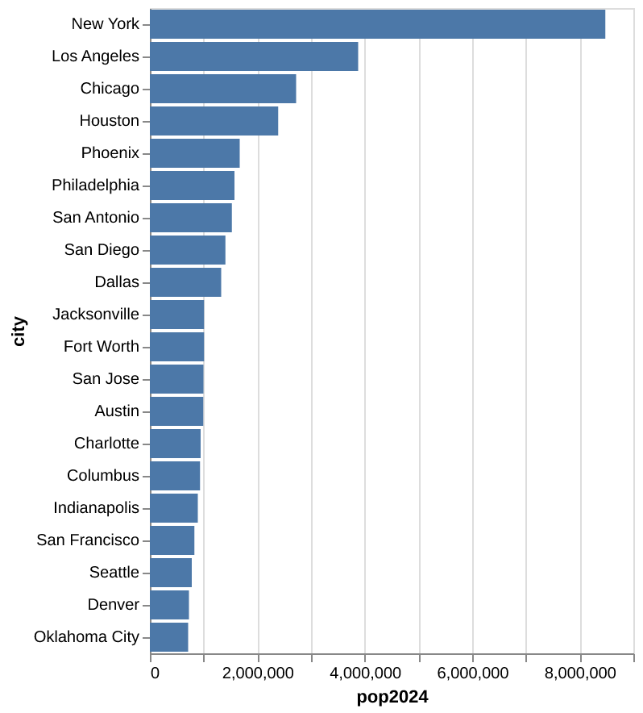
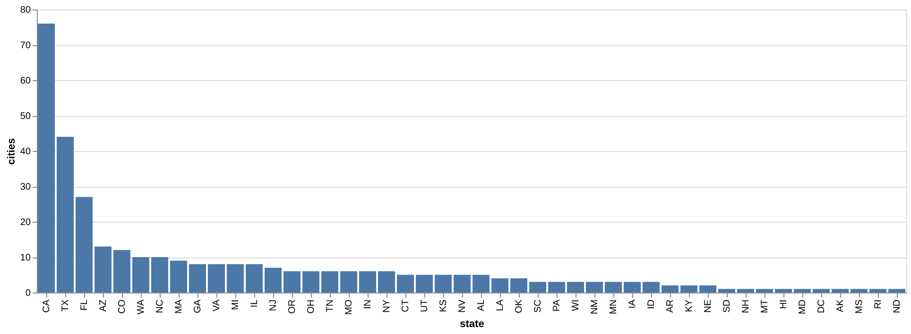
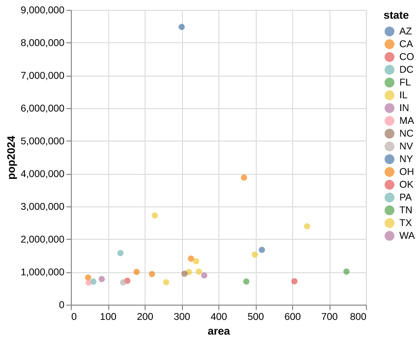

## Setup

```
pip install polars
pip install altair
pip install vl-convert-python
```

## Links

https://altair-viz.github.io/altair-tutorial/README.html

https://docs.pola.rs/

https://en.wikipedia.org/wiki/List_of_United_States_cities_by_population

https://wikitable2csv.ggor.de/

https://survey.stackoverflow.co/2018

https://ww2.amstat.org/censusatschool/RandomSampleForm.cfm

https://matplotlib.org/

## Polars Cheatsheet

```py
import polars as pl

cities = pl.read_csv("cities.csv") # Load dataframe from CSV
```

### View Data

```py
cities
```

```
shape: (346, 5)
┌─────────────┬───────┬─────────┬─────────┬───────┐
│ city        ┆ state ┆ pop2024 ┆ pop2020 ┆ area  │
│ ---         ┆ ---   ┆ ---     ┆ ---     ┆ ---   │
│ str         ┆ str   ┆ i64     ┆ i64     ┆ f64   │
╞═════════════╪═══════╪═════════╪═════════╪═══════╡
│ New York    ┆ NY    ┆ 8478072 ┆ 8804190 ┆ 300.5 │
│ Los Angeles ┆ CA    ┆ 3878704 ┆ 3898747 ┆ 469.5 │
│ Chicago     ┆ IL    ┆ 2721308 ┆ 2746388 ┆ 227.7 │
│ Houston     ┆ TX    ┆ 2390125 ┆ 2304580 ┆ 640.4 │
│ Phoenix     ┆ AZ    ┆ 1673164 ┆ 1608139 ┆ 518.0 │
│ …           ┆ …     ┆ …       ┆ …       ┆ …     │
│ Deltona     ┆ FL    ┆ 100513  ┆ 93692   ┆ 37.3  │
│ Federal Way ┆ WA    ┆ 100252  ┆ 101030  ┆ 22.3  │
│ San Angelo  ┆ TX    ┆ 100159  ┆ 99893   ┆ 59.7  │
│ Tracy       ┆ CA    ┆ 100136  ┆ 93000   ┆ 25.9  │
│ Sunrise     ┆ FL    ┆ 100128  ┆ 97335   ┆ 16.2  │
└─────────────┴───────┴─────────┴─────────┴───────┘
```

### Get Rows

```py
cities.head(5)
```

```
shape: (5, 5)
┌─────────────┬───────┬─────────┬─────────┬───────┐
│ city        ┆ state ┆ pop2024 ┆ pop2020 ┆ area  │
│ ---         ┆ ---   ┆ ---     ┆ ---     ┆ ---   │
│ str         ┆ str   ┆ i64     ┆ i64     ┆ f64   │
╞═════════════╪═══════╪═════════╪═════════╪═══════╡
│ New York    ┆ NY    ┆ 8478072 ┆ 8804190 ┆ 300.5 │
│ Los Angeles ┆ CA    ┆ 3878704 ┆ 3898747 ┆ 469.5 │
│ Chicago     ┆ IL    ┆ 2721308 ┆ 2746388 ┆ 227.7 │
│ Houston     ┆ TX    ┆ 2390125 ┆ 2304580 ┆ 640.4 │
│ Phoenix     ┆ AZ    ┆ 1673164 ┆ 1608139 ┆ 518.0 │
└─────────────┴───────┴─────────┴─────────┴───────┘
```

```py
cities.tail(5)
```

```
shape: (5, 5)
┌─────────────┬───────┬─────────┬─────────┬──────┐
│ city        ┆ state ┆ pop2024 ┆ pop2020 ┆ area │
│ ---         ┆ ---   ┆ ---     ┆ ---     ┆ ---  │
│ str         ┆ str   ┆ i64     ┆ i64     ┆ f64  │
╞═════════════╪═══════╪═════════╪═════════╪══════╡
│ Deltona     ┆ FL    ┆ 100513  ┆ 93692   ┆ 37.3 │
│ Federal Way ┆ WA    ┆ 100252  ┆ 101030  ┆ 22.3 │
│ San Angelo  ┆ TX    ┆ 100159  ┆ 99893   ┆ 59.7 │
│ Tracy       ┆ CA    ┆ 100136  ┆ 93000   ┆ 25.9 │
│ Sunrise     ┆ FL    ┆ 100128  ┆ 97335   ┆ 16.2 │
└─────────────┴───────┴─────────┴─────────┴──────┘
```

### Get Column Names

```py
cities.columns
```

```
['city', 'state', 'pop2024', 'pop2020', 'area']
```

### Select Columns

```py
cities.select("city", "pop2024")
```

```
shape: (346, 2)
┌─────────────┬─────────┐
│ city        ┆ pop2024 │
│ ---         ┆ ---     │
│ str         ┆ i64     │
╞═════════════╪═════════╡
│ New York    ┆ 8478072 │
│ Los Angeles ┆ 3878704 │
│ Chicago     ┆ 2721308 │
│ Houston     ┆ 2390125 │
│ Phoenix     ┆ 1673164 │
│ …           ┆ …       │
│ Deltona     ┆ 100513  │
│ Federal Way ┆ 100252  │
│ San Angelo  ┆ 100159  │
│ Tracy       ┆ 100136  │
│ Sunrise     ┆ 100128  │
└─────────────┴─────────┘
```

### Add Columns

```py
cities.with_columns(
	(pl.col("pop2024") / pl.col("area")).round(1).alias("popDensity"),
	((pl.col("pop2024") / pl.col("pop2020") - 1) * 100).round(2).alias("pctChange"),
)
```

```
shape: (346, 7)
┌─────────────┬───────┬─────────┬─────────┬───────┬────────────┬───────────┐
│ city        ┆ state ┆ pop2024 ┆ pop2020 ┆ area  ┆ popDensity ┆ pctChange │
│ ---         ┆ ---   ┆ ---     ┆ ---     ┆ ---   ┆ ---        ┆ ---       │
│ str         ┆ str   ┆ i64     ┆ i64     ┆ f64   ┆ f64        ┆ f64       │
╞═════════════╪═══════╪═════════╪═════════╪═══════╪════════════╪═══════════╡
│ New York    ┆ NY    ┆ 8478072 ┆ 8804190 ┆ 300.5 ┆ 28213.2    ┆ -3.7      │
│ Los Angeles ┆ CA    ┆ 3878704 ┆ 3898747 ┆ 469.5 ┆ 8261.4     ┆ -0.51     │
│ Chicago     ┆ IL    ┆ 2721308 ┆ 2746388 ┆ 227.7 ┆ 11951.3    ┆ -0.91     │
│ Houston     ┆ TX    ┆ 2390125 ┆ 2304580 ┆ 640.4 ┆ 3732.2     ┆ 3.71      │
│ Phoenix     ┆ AZ    ┆ 1673164 ┆ 1608139 ┆ 518.0 ┆ 3230.0     ┆ 4.04      │
│ …           ┆ …     ┆ …       ┆ …       ┆ …     ┆ …          ┆ …         │
│ Deltona     ┆ FL    ┆ 100513  ┆ 93692   ┆ 37.3  ┆ 2694.7     ┆ 7.28      │
│ Federal Way ┆ WA    ┆ 100252  ┆ 101030  ┆ 22.3  ┆ 4495.6     ┆ -0.77     │
│ San Angelo  ┆ TX    ┆ 100159  ┆ 99893   ┆ 59.7  ┆ 1677.7     ┆ 0.27      │
│ Tracy       ┆ CA    ┆ 100136  ┆ 93000   ┆ 25.9  ┆ 3866.3     ┆ 7.67      │
│ Sunrise     ┆ FL    ┆ 100128  ┆ 97335   ┆ 16.2  ┆ 6180.7     ┆ 2.87      │
└─────────────┴───────┴─────────┴─────────┴───────┴────────────┴───────────┘
```

### Remove Columns

```py
cities.drop("pop2020", "area")
```

```
shape: (346, 3)
┌─────────────┬───────┬─────────┐
│ city        ┆ state ┆ pop2024 │
│ ---         ┆ ---   ┆ ---     │
│ str         ┆ str   ┆ i64     │
╞═════════════╪═══════╪═════════╡
│ New York    ┆ NY    ┆ 8478072 │
│ Los Angeles ┆ CA    ┆ 3878704 │
│ Chicago     ┆ IL    ┆ 2721308 │
│ Houston     ┆ TX    ┆ 2390125 │
│ Phoenix     ┆ AZ    ┆ 1673164 │
│ …           ┆ …     ┆ …       │
│ Deltona     ┆ FL    ┆ 100513  │
│ Federal Way ┆ WA    ┆ 100252  │
│ San Angelo  ┆ TX    ┆ 100159  │
│ Tracy       ┆ CA    ┆ 100136  │
│ Sunrise     ┆ FL    ┆ 100128  │
└─────────────┴───────┴─────────┘
```

### Rename Columns

```py
cities.rename({"area": "areaSqMiles"})
```

```
shape: (346, 5)
┌─────────────┬───────┬─────────┬─────────┬─────────────┐
│ city        ┆ state ┆ pop2024 ┆ pop2020 ┆ areaSqMiles │
│ ---         ┆ ---   ┆ ---     ┆ ---     ┆ ---         │
│ str         ┆ str   ┆ i64     ┆ i64     ┆ f64         │
╞═════════════╪═══════╪═════════╪═════════╪═════════════╡
│ New York    ┆ NY    ┆ 8478072 ┆ 8804190 ┆ 300.5       │
│ Los Angeles ┆ CA    ┆ 3878704 ┆ 3898747 ┆ 469.5       │
│ Chicago     ┆ IL    ┆ 2721308 ┆ 2746388 ┆ 227.7       │
│ Houston     ┆ TX    ┆ 2390125 ┆ 2304580 ┆ 640.4       │
│ Phoenix     ┆ AZ    ┆ 1673164 ┆ 1608139 ┆ 518.0       │
│ …           ┆ …     ┆ …       ┆ …       ┆ …           │
│ Deltona     ┆ FL    ┆ 100513  ┆ 93692   ┆ 37.3        │
│ Federal Way ┆ WA    ┆ 100252  ┆ 101030  ┆ 22.3        │
│ San Angelo  ┆ TX    ┆ 100159  ┆ 99893   ┆ 59.7        │
│ Tracy       ┆ CA    ┆ 100136  ┆ 93000   ┆ 25.9        │
│ Sunrise     ┆ FL    ┆ 100128  ┆ 97335   ┆ 16.2        │
└─────────────┴───────┴─────────┴─────────┴─────────────┘
```

### Filter Rows

```py
cities.filter(pl.col("state") == "TX")
```

```
shape: (44, 5)
┌───────────────┬───────┬─────────┬─────────┬───────┐
│ city          ┆ state ┆ pop2024 ┆ pop2020 ┆ area  │
│ ---           ┆ ---   ┆ ---     ┆ ---     ┆ ---   │
│ str           ┆ str   ┆ i64     ┆ i64     ┆ f64   │
╞═══════════════╪═══════╪═════════╪═════════╪═══════╡
│ Houston       ┆ TX    ┆ 2390125 ┆ 2304580 ┆ 640.4 │
│ San Antonio   ┆ TX    ┆ 1526656 ┆ 1434625 ┆ 498.8 │
│ Dallas        ┆ TX    ┆ 1326087 ┆ 1304379 ┆ 339.6 │
│ Fort Worth    ┆ TX    ┆ 1008106 ┆ 918915  ┆ 347.3 │
│ Austin        ┆ TX    ┆ 993588  ┆ 961855  ┆ 319.9 │
│ …             ┆ …     ┆ …       ┆ …       ┆ …     │
│ Sugar Land    ┆ TX    ┆ 109851  ┆ 111026  ┆ 40.5  │
│ Edinburg      ┆ TX    ┆ 108733  ┆ 100243  ┆ 44.7  │
│ Wichita Falls ┆ TX    ┆ 102372  ┆ 102316  ┆ 72.0  │
│ Georgetown    ┆ TX    ┆ 101344  ┆ 67176   ┆ 57.3  │
│ San Angelo    ┆ TX    ┆ 100159  ┆ 99893   ┆ 59.7  │
└───────────────┴───────┴─────────┴─────────┴───────┘
```

```py
cities.filter(pl.col("pop2024") > 1000000)
```

```
shape: (11, 5)
┌──────────────┬───────┬─────────┬─────────┬───────┐
│ city         ┆ state ┆ pop2024 ┆ pop2020 ┆ area  │
│ ---          ┆ ---   ┆ ---     ┆ ---     ┆ ---   │
│ str          ┆ str   ┆ i64     ┆ i64     ┆ f64   │
╞══════════════╪═══════╪═════════╪═════════╪═══════╡
│ New York     ┆ NY    ┆ 8478072 ┆ 8804190 ┆ 300.5 │
│ Los Angeles  ┆ CA    ┆ 3878704 ┆ 3898747 ┆ 469.5 │
│ Chicago      ┆ IL    ┆ 2721308 ┆ 2746388 ┆ 227.7 │
│ Houston      ┆ TX    ┆ 2390125 ┆ 2304580 ┆ 640.4 │
│ Phoenix      ┆ AZ    ┆ 1673164 ┆ 1608139 ┆ 518.0 │
│ …            ┆ …     ┆ …       ┆ …       ┆ …     │
│ San Antonio  ┆ TX    ┆ 1526656 ┆ 1434625 ┆ 498.8 │
│ San Diego    ┆ CA    ┆ 1404452 ┆ 1386932 ┆ 325.9 │
│ Dallas       ┆ TX    ┆ 1326087 ┆ 1304379 ┆ 339.6 │
│ Jacksonville ┆ FL    ┆ 1009833 ┆ 949611  ┆ 747.3 │
│ Fort Worth   ┆ TX    ┆ 1008106 ┆ 918915  ┆ 347.3 │
└──────────────┴───────┴─────────┴─────────┴───────┘
```

### Sort Rows

```py
cities.sort("city")
```

```
shape: (346, 5)
┌───────────────┬───────┬─────────┬─────────┬───────┐
│ city          ┆ state ┆ pop2024 ┆ pop2020 ┆ area  │
│ ---           ┆ ---   ┆ ---     ┆ ---     ┆ ---   │
│ str           ┆ str   ┆ i64     ┆ i64     ┆ f64   │
╞═══════════════╪═══════╪═════════╪═════════╪═══════╡
│ Abilene       ┆ TX    ┆ 130501  ┆ 125182  ┆ 106.7 │
│ Akron         ┆ OH    ┆ 189664  ┆ 190469  ┆ 61.9  │
│ Albany        ┆ NY    ┆ 101317  ┆ 99224   ┆ 21.4  │
│ Albuquerque   ┆ NM    ┆ 560326  ┆ 564559  ┆ 187.3 │
│ Alexandria    ┆ VA    ┆ 159102  ┆ 159467  ┆ 14.9  │
│ …             ┆ …     ┆ …       ┆ …       ┆ …     │
│ Winston-Salem ┆ NC    ┆ 255769  ┆ 249545  ┆ 132.7 │
│ Woodbridge    ┆ NJ    ┆ 106101  ┆ 103639  ┆ 23.3  │
│ Worcester     ┆ MA    ┆ 211286  ┆ 206518  ┆ 37.4  │
│ Yonkers       ┆ NY    ┆ 211040  ┆ 211569  ┆ 18.0  │
│ Yuma          ┆ AZ    ┆ 103559  ┆ 95548   ┆ 120.7 │
└───────────────┴───────┴─────────┴─────────┴───────┘
```

```py
cities.sort("area", descending=True)
```

```
shape: (346, 5)
┌───────────────┬───────┬─────────┬─────────┬────────┐
│ city          ┆ state ┆ pop2024 ┆ pop2020 ┆ area   │
│ ---           ┆ ---   ┆ ---     ┆ ---     ┆ ---    │
│ str           ┆ str   ┆ i64     ┆ i64     ┆ f64    │
╞═══════════════╪═══════╪═════════╪═════════╪════════╡
│ Anchorage     ┆ AK    ┆ 289600  ┆ 291247  ┆ 1706.8 │
│ Jacksonville  ┆ FL    ┆ 1009833 ┆ 949611  ┆ 747.3  │
│ Houston       ┆ TX    ┆ 2390125 ┆ 2304580 ┆ 640.4  │
│ Oklahoma City ┆ OK    ┆ 712919  ┆ 681054  ┆ 606.2  │
│ Phoenix       ┆ AZ    ┆ 1673164 ┆ 1608139 ┆ 518.0  │
│ …             ┆ …     ┆ …       ┆ …       ┆ …      │
│ El Monte      ┆ CA    ┆ 104639  ┆ 109450  ┆ 9.6    │
│ Inglewood     ┆ CA    ┆ 102774  ┆ 107762  ┆ 9.1    │
│ Paterson      ┆ NJ    ┆ 160463  ┆ 159732  ┆ 8.4    │
│ Daly City     ┆ CA    ┆ 101418  ┆ 104901  ┆ 7.6    │
│ Cambridge     ┆ MA    ┆ 121186  ┆ 118403  ┆ 6.4    │
└───────────────┴───────┴─────────┴─────────┴────────┘
```

### Aggregation

```py
(
	cities
		.group_by("state")
		.agg(pl.len().alias("count"))
		.sort("count", descending=True)
)
```

```
shape: (46, 2)
┌───────┬───────┐
│ state ┆ count │
│ ---   ┆ ---   │
│ str   ┆ u32   │
╞═══════╪═══════╡
│ CA    ┆ 76    │
│ TX    ┆ 44    │
│ FL    ┆ 27    │
│ AZ    ┆ 13    │
│ CO    ┆ 12    │
│ …     ┆ …     │
│ HI    ┆ 1     │
│ MS    ┆ 1     │
│ ND    ┆ 1     │
│ MT    ┆ 1     │
│ DC    ┆ 1     │
└───────┴───────┘
```

```py
(
	cities
		.with_columns((pl.col("pop2024") - pl.col("pop2020")).alias("deltaPop"))
		.group_by("state")
		.agg(pl.col("deltaPop").sum())
		.sort("deltaPop", descending=True)
)
```

```
┌───────┬──────────┐
│ state ┆ deltaPop │
│ ---   ┆ ---      │
│ str   ┆ i64      │
╞═══════╪══════════╡
│ TX    ┆ 682767   │
│ FL    ┆ 431452   │
│ AZ    ┆ 226662   │
│ NC    ┆ 164454   │
│ NV    ┆ 121579   │
│ …     ┆ …        │
│ MD    ┆ -17437   │
│ PA    ┆ -23891   │
│ IL    ┆ -24017   │
│ LA    ┆ -37968   │
│ NY    ┆ -332855  │
└───────┴──────────┘
```

## Graphing Tutorial

```py
import polars as pl
import altair as alt

cities = pl.read_csv("cities.csv") # Load dataframe from CSV
```

### Bar Charts

```py
topCities = cities.sort("pop2024", descending = True).head(20)
chart = alt.Chart(topCities).mark_bar().encode(alt.X("pop2024"), alt.Y("city", sort="-x"))
chart.save("pop-bars.png", scale_factor = 2)
```



```py
counts = (
    cities
        .group_by("state")
        .agg(pl.len().alias("cities"))
        .sort("cities", descending = True)
)

chart = alt.Chart(counts).mark_bar().encode(alt.X("state", sort = "-y"), alt.Y("cities"))
chart.save("city-counts.png", scale_factor = 2)
```



### Scatter Plot

```py
top25 = cities.sort("pop2024", descending = True).head(25)

chart = alt.Chart(top25).mark_circle(size = 40).encode(
    alt.X("area"),
    alt.Y("pop2024"),
    alt.Color("state"),
)

chart.save("pop-area-scatter.png", scale_factor = 2)
```


